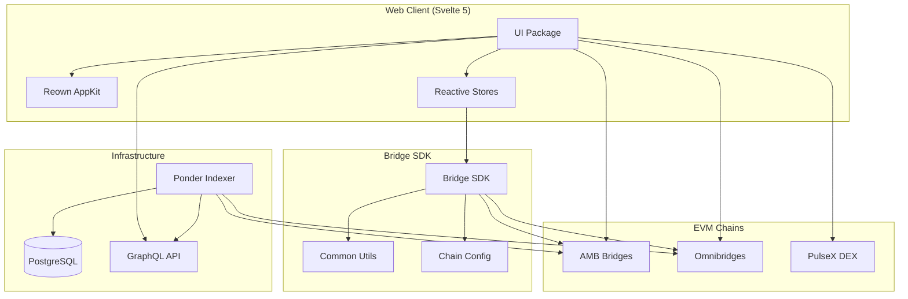
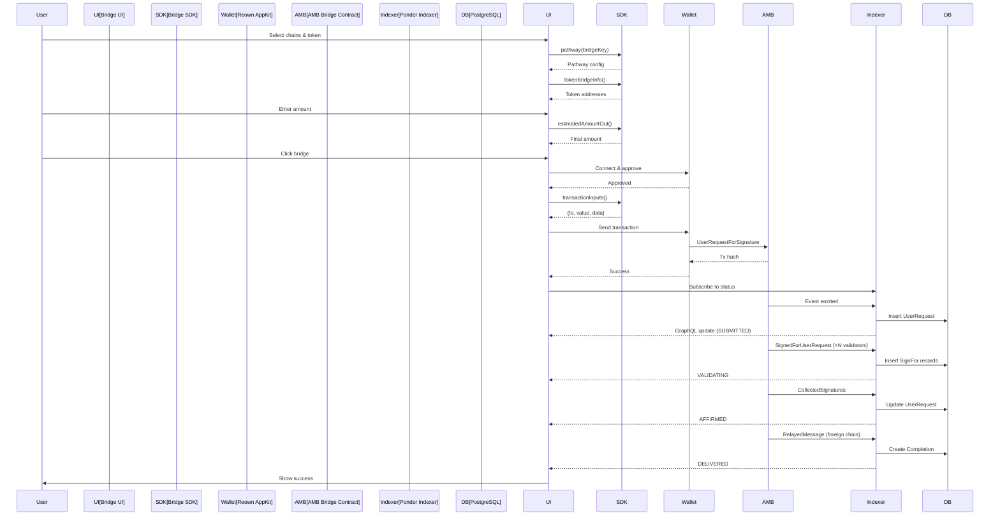
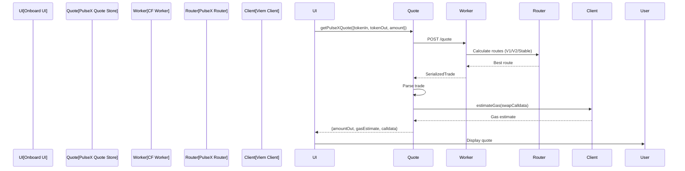
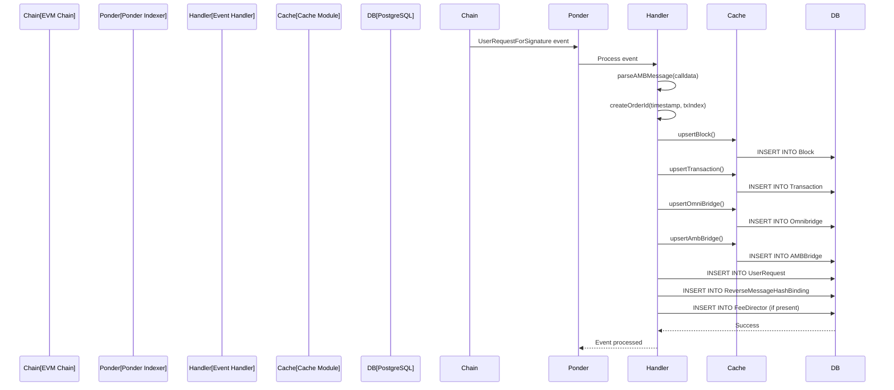

# Bridge-Routing Codebase Map

> Auto-generated by Cartographer on 2026-02-15

## System Overview

**Gibs Finance** is a production cross-chain token bridge platform enabling transfers between Pulsechain, Ethereum, BSC, and testnets. The architecture is a Yarn v4 monorepo with four packages working in concert:



**Tech Stack:**
- **Frontend**: Svelte 5 (runes), Vite 6, TailwindCSS v4, TypeScript
- **Web3**: Viem 2.37, Wagmi 2.14, Reown AppKit (WalletConnect v2)
- **Backend**: Ponder 0.14 (event indexer), PostgreSQL 16, Hono (API)
- **Build**: Yarn v4 workspaces, Docker Compose

---

## Directory Structure

```
bridge-routing/
├── packages/
│   ├── common/              # Low-level blockchain utilities
│   │   └── src/
│   │       ├── cache.ts     # Memoization (LRU, TTL)
│   │       ├── client.ts    # Viem client factory with fallback
│   │       ├── erc20.ts     # ERC20 metadata fetcher
│   │       ├── multicall.ts # Batch contract reads
│   │       ├── serialize.ts # BigInt JSON serialization
│   │       └── types.ts     # Type definitions
│   │
│   ├── bridge-sdk/          # Bridge configuration & transaction builder
│   │   └── src/
│   │       ├── abis.ts      # Parsed contract ABIs
│   │       ├── chain-info.ts # Token mappings, fee loading
│   │       ├── chains.ts    # Bridge pathways & configs
│   │       ├── config.ts    # Re-export of chains
│   │       ├── fee-type.ts  # Fee calculation strategies
│   │       ├── image-links.ts # Asset image URL generator
│   │       ├── settings.ts  # Transaction construction
│   │       └── types.ts     # Domain types
│   │
│   ├── indexer/             # Blockchain event indexer
│   │   ├── abis/            # Contract ABIs (9 files)
│   │   ├── src/
│   │   │   ├── api/index.ts      # Hono GraphQL server
│   │   │   ├── cache.ts          # DB upsert helpers
│   │   │   ├── config.ts         # Chain pairings
│   │   │   ├── index.ts          # Event handlers (15 handlers)
│   │   │   ├── message.ts        # AMB message parser
│   │   │   └── utils.ts          # RPC transports, orderId
│   │   ├── ponder.config.ts      # Indexer configuration
│   │   └── ponder.schema.ts      # PostgreSQL schema (25 tables)
│   │
│   └── ui/                  # Svelte 5 frontend
│       ├── public/          # Static assets (images, robots.txt)
│       ├── src/
│       │   ├── lib/
│       │   │   ├── components/   # 77 Svelte components
│       │   │   ├── pages/        # 4 page components
│       │   │   ├── stores/       # 67 reactive stores
│       │   │   │   ├── auth/     # Wallet connection (4 files)
│       │   │   │   └── pulsex/   # DEX integration (32 files)
│       │   │   ├── gql/          # GraphQL types (generated)
│       │   │   ├── config.ts     # Environment variables
│       │   │   ├── types.svelte.ts
│       │   │   └── utils.svelte.ts
│       │   ├── app.css           # Global styles
│       │   ├── App.svelte        # Router
│       │   ├── Layout.svelte     # Layout wrapper
│       │   └── main.ts           # Entry point
│       ├── index.html            # HTML entry
│       ├── vite.config.ts        # Vite configuration
│       └── package.json
│
├── scripts/
│   └── sync-versions.js     # Version synchronization
├── docker-compose.yml       # Local dev orchestration
├── Dockerfile               # Production container
├── package.json             # Monorepo root
└── README.md
```

---

## Package Guide

### `@gibs/common` (Foundation)

**Purpose**: Low-level utilities for blockchain interactions

**Entry point**: `packages/common/src/index.ts`

**Key files**:
| File | Purpose | Tokens |
|------|---------|--------|
| cache.ts | LRU and TTL memoization | 362 |
| client.ts | Viem PublicClient factory with fallback | 409 |
| erc20.ts | ERC20 metadata fetcher (multicall) | 283 |
| multicall.ts | Batch contract reads (multicall3) | 477 |
| serialize.ts | BigInt JSON serialization | 212 |
| types.ts | Type definitions | 91 |

**Exports**:
- `maxMemoize<A, B>(fn, max)` - LRU cache (default 1024 entries)
- `ttlMemoizeSingle<A, B>(fn, ttl)` - Single-value TTL cache (1 hour default)
- `clientFromChain({ chain, urls })` - Creates PublicClient with fallback transport
- `multicallRead({ chain, client, abi, calls, target })` - Batch contract calls
- `multicallErc20({ client, target, chain })` - Fetch token name/symbol/decimals
- `jsonAnyStringify`, `jsonAnyParse` - BigInt-aware JSON helpers

**Dependencies**: Viem, Lodash

**Gotchas**:
- Cache keys use `JSON.stringify` with BigInt support
- `maxMemoize` is FIFO, not true LRU (evicts oldest)
- `ttlMemoizeSingle` only caches one result regardless of arguments
- ERC20 fetcher falls back to bytes32 ABI for old tokens (MKR-style)

---

### `@gibs/bridge-sdk` (Application)

**Purpose**: Bridge configuration, pathways, and transaction construction

**Entry point**: `packages/bridge-sdk/src/index.ts`

**Key files**:
| File | Purpose | Tokens |
|------|---------|--------|
| abis.ts | Parsed contract ABIs | 844 |
| chain-info.ts | Token mappings, fee loading, price discovery | 3431 |
| chains.ts | Bridge pathways and chain configs | 723 |
| fee-type.ts | Fee calculation strategies (FIXED, GAS_TIP, PERCENT) | 113 |
| image-links.ts | Asset image URL generator | 361 |
| settings.ts | Transaction construction and fee calculation | 6598 |
| types.ts | Domain type definitions | 282 |

**Exports**:
- **Chain Config**: `Chains` enum, `pathways`, `bridgeConfigs`, `validBridgeKeys()`, `inferBridgeKey()`
- **Token Info**: `links()`, `tokenBridgeInfo()`, `minBridgeAmountIn()`, `nativeSymbol()`
- **Fee Calculation**: `bridgeCost()`, `estimatedFee()`, `estimatedAmountOut()`, `isUndercompensated()`
- **Transaction Building**: `transactionInputs()`, `destinationDataParam()`, `feeDirectorStructEncoded()`
- **ABIs**: `inputBridge`, `outputBridge`, `feeManager`, `homeAmb`, `univ2Router`, etc.
- **Images**: `setImageRoot()`, `network()`, `image()`, `images()`

**Dependencies**: `@gibs/common`, Viem, Lodash

**Gotchas**:
- Functions return `null` liberally for invalid states
- Heavy use of memoization (permanent, no TTL)
- Bridge direction matters: `toHome` vs `toForeign` have different fee managers
- Delivery service only required for home→foreign on certain bridges
- Unwrapping only available for bridged native assets returning home
- Transaction construction has 3 code paths: native token, bridge token (ERC677), normal ERC20
- `reasonablePercentFee` clamps to 0.05%-10% range
- Undercompensation check skips GAS_TIP fee type

---

### `indexer` (Event Indexer)

**Purpose**: Ponder-based blockchain event indexer with GraphQL API

**Entry point**: `packages/indexer/src/index.ts`

**Key files**:
| File | Purpose | Tokens |
|------|---------|--------|
| ponder.config.ts | Chain/contract configuration, event filters | 2247 |
| ponder.schema.ts | PostgreSQL schema (25 tables) | 5898 |
| src/index.ts | Event handlers (15 handlers) | 5945 |
| src/message.ts | AMB message parser | 1899 |
| src/cache.ts | DB upsert helpers | 1835 |
| src/utils.ts | RPC transports, contract lookups, orderId | 2675 |
| src/api/index.ts | Hono GraphQL server | 81 |

**Database Schema** (25 tables):
- **Infrastructure**: `AMBBridge`, `Omnibridge`, `ValidatorContract`, `Validator`, `FeeManagerContract`
- **Events**: `Block`, `Transaction`, `UserRequest`, `SignFor`, `Completion`, `Delivery`
- **Config**: `RequiredSignaturesChanged`, `ValidatorStatusUpdate`, `FeeUpdate`, `LatestFeeUpdate`
- **Tokens**: `Token`, `FeeDirector`, `ReverseMessageHashBinding`

**Event Handlers**:
1. `ValidatorContract:ValidatorAdded/Removed` - Validator management
2. `ValidatorContract:RequiredSignaturesChanged` - Signature threshold
3. `HomeAMB:UserRequestForSignature` - Home→foreign bridge start
4. `ForeignAMB:UserRequestForAffirmation` - Foreign→home bridge start
5. `HomeAMB:SignedForAffirmation/SignedForUserRequest` - Validator signatures
6. `HomeAMB:CollectedSignatures` - Signature collection complete
7. `HomeAMB:AffirmationCompleted` - Foreign→home complete
8. `ForeignAMB:RelayedMessage` - Home→foreign complete
9. `BasicOmnibridge:NewTokenRegistered` - New bridged token
10. `BasicOmnibridge:TokensBridgingInitiated` - Bridge tx initiated
11. `BasicOmnibridge:TokensBridged` - Tokens delivered
12. `FeeManager:FeeUpdated` - Fee configuration changed
13. `BasicOmnibridge:FeeDistributed` - Fee collected

**Dependencies**: Ponder, Viem, Hono, `@gibs/bridge-sdk`

**Gotchas**:
- Uses omnichain ordering (cross-chain event sequencing by timestamp)
- `orderId` formula: `(timestamp << 32) | (txIndex << 16) | (logIndex << 8) | chainId`
- Contract addresses fetched dynamically at startup via RPC calls
- Special token filtering for certain Sepolia/Mainnet tokens
- Zero-signer bridges supported (no required signatures)
- Fee lookup falls back: token-specific → default (zeroAddress) → 0n
- Completion created twice for foreign→home (both chains)

---

### `ui` (Frontend)

**Purpose**: Svelte 5 UI with reactive stores and wallet integration

**Entry point**: `packages/ui/src/main.ts` → `App.svelte`

**Key files**:
| File | Purpose | Tokens |
|------|---------|--------|
| src/App.svelte | Router (hash-based) | 328 |
| src/Layout.svelte | Nav/Footer wrapper | 590 |
| src/lib/pages/Bridge.svelte | Token bridge interface | 635 |
| src/lib/pages/Onboard.svelte | Onramp/swap interface | 481 |
| src/lib/pages/Home.svelte | Landing page | 85 |
| src/lib/components/Bridge.svelte | Main bridge form | 2289 |
| src/lib/components/BridgeHistory.svelte | Transaction history | 8068 |
| src/lib/components/Onboard*.svelte | Onboarding flow | ~10k |
| src/lib/stores/bridge-settings.svelte.ts | Bridge config & calculations | 5206 |
| src/lib/stores/chain-events.svelte.ts | Block watchers & status | 5490 |
| src/lib/stores/input.svelte.ts | User input state | 2868 |
| src/lib/stores/auth/AuthProvider.svelte.ts | Wallet connection | 1667 |
| src/lib/stores/pulsex/* | PulseX DEX integration | ~15k |
| src/lib/gql/graphql.ts | GraphQL types (generated) | 26468 |

**Routes**:
- `/` → Home (Welcome, explainers)
- `/bridge` → Bridge interface
- `/onboard` → Onramp/swap flow
- `/delivery` → Redirects to bridge

**Component Groups**:
- **Bridge**: Bridge.svelte, BridgeDetails, BridgeHistory, BridgeProgress, BridgeConfirmationModal (13 components)
- **Onboard**: Onboard.svelte, OnboardForeignBridge, OnboardSettings, OnboardGuide (8 components)
- **Form**: FromNetwork, ToNetwork, SectionInput, TokenSelect, NumericInput, DestinationController (6 components)
- **UI**: ModalWrapper, Button, Tooltip, Warning, Loading, Loader (20+ components)
- **Asset**: AssetWithNetwork, TokenIcon, StaticNetworkImage, ProviderIcon (4 components)
- **Navigation**: Nav, Footer, Welcome (3 components)
- **Integration**: LifiWidget, ReactAdapter (2 components)

**Store Categories**:
- **Core**: bridge-settings, input, config, theme (4 stores)
- **Blockchain**: chain-events, chain-read, fee-manager, rpcs (4 stores)
- **Wallet**: auth/AuthProvider, auth/store, auth/types (3 stores)
- **UI State**: app-page, nav, page, settings, window, loading (6 stores)
- **Persistence**: storage, localstorage, custom-tokens (3 stores)
- **DEX**: pulsex/* (32 files for quote, routing, calldata)
- **Utilities**: history, token-metadata-cache, transactions, utils (10+ stores)

**Dependencies**: Svelte 5, Vite 6, TailwindCSS v4, Skeleton UI, Viem, Wagmi, Reown AppKit, PulseX SDK, LI.FI Widget

**Gotchas**:
- Uses Svelte 5 runes (`$state`, `$derived`, `$effect`) - not compatible with Svelte 4
- Embeds React components (LI.FI) via `@bigmi/react`
- TailwindCSS v4 CSS-first approach (uses `@import 'tailwindcss'`)
- Environment variables must be prefixed `PUBLIC_*` and are replaced at build time
- Hash-based routing for static hosting compatibility
- Heavy use of `AbortController` for async cleanup
- `$effect` blocks create cascading reactive pipelines
- Bridge-settings has ~25 `$derived` computed values

---

## Data Flow

### Bridge Transaction Flow



### PulseX Swap Quote Flow



### Indexer Event Processing



---

## Configuration Dependencies

### Environment Variables

**Required for UI**:
- `PUBLIC_PROJECT_ID` - WalletConnect project ID
- `PUBLIC_IMAGE_ROOT` - Base URL for images (default: https://gib.show)
- `PUBLIC_INDEXER` - GraphQL endpoint (default: https://staging.indexer.gibs.finance)
- `PUBLIC_NODE_ENV` - Environment (development/production)

**Required for Indexer**:
- `DATABASE_URL` - PostgreSQL connection string
- `PONDER_RPC_URL_1` - Ethereum RPC
- `PONDER_RPC_URL_369` - PulseChain RPC
- `PONDER_RPC_URL_56` - BSC RPC
- `PONDER_RPC_URL_11155111` - Sepolia RPC
- `PONDER_RPC_URL_943` - PulseChain V4 RPC

**Optional**:
- `PONDER_RPC_URL_{chainId}_{index}` - Additional RPC fallbacks
- `DEPLOYMENT_ID` - Indexer instance identifier (for multi-deploy)
- `PINATA_API_KEY` - For IPFS deployment

### Hardcoded Contract Addresses

Located in `packages/bridge-sdk/src/chains.ts`:
- AMB bridges (home/foreign)
- Omnibridge contracts
- Fee managers
- Validator contracts
- Uniswap V2 routers
- PulseX routers

### Chain Configurations

**Mainnet**:
- Pulsechain (369): Home for Pulsechain↔Ethereum, Pulsechain↔BSC
- Ethereum (1): Foreign for Pulsechain↔Ethereum
- BSC (56): Foreign for Pulsechain↔BSC

**Testnet**:
- Pulsechain V4 (943): Home for testnet bridges
- Sepolia (11155111): Foreign for testnet bridges

---

## Conventions

### Code Style

**TypeScript**:
- Strict mode enabled
- Prefer `unknown` over `any`
- Use discriminated unions over type assertions
- `as const` for literal types
- Null propagation pattern (functions return `null` for invalid states)

**Svelte**:
- Functional components only (Svelte 5 runes)
- Custom stores for stateful logic
- Proper dependency arrays in `$effect`
- Colocate related code

**Naming**:
- `camelCase` for variables/functions
- `PascalCase` for classes/types
- `SCREAMING_SNAKE_CASE` for constants
- No abbreviations (`getUserAccount` not `getUsrAcct`)

**Patterns**:
- Single responsibility functions
- Immutability preference
- Composition over inheritance
- Explicit over implicit
- Fail fast with clear errors
- Delete dead code aggressively

### File Organization

- **Source**: `/packages/{package}/src/`
- **Tests**: Not present (TODO)
- **Config**: Root of each package
- **Documentation**: `/docs/` (not root)
- **Scripts**: `/scripts/`

### Commit Messages

- Conventional Commits format: `type(scope): subject`
- Max 50 chars subject line
- Focus on "why" not "what"
- Reference issues: `Fixes #123`, `Closes #456`

---

## Gotchas

### Critical Edge Cases

1. **Not-Yet-Bridged Tokens**: `TokenBridgeInfo.assetOutAddress` can be `null` - must check before use
2. **Zero-Signer Bridges**: Some bridges have no required signatures (`requiredSignatureOrderId = null`)
3. **Fee Direction**: Fee manager may be on source or destination chain depending on bridge direction
4. **Delivery Service**: Only required for home→foreign on certain bridges (`requiresDelivery: true`)
5. **Unwrapping**: Only available for bridged native assets returning home (e.g., bridged WPLS→PLS)
6. **Extra Parameters**: Some bridges require sender origin (Tokensex on BSC uses `usesExtraParam`)
7. **Undercompensation**: Fixed/percent fees may not cover actual gas costs
8. **Price Discovery**: Checks multiple DEX routes, takes max output across all routers
9. **Bytes32 Tokens**: Old ERC20s (MKR) with bytes32 name/symbol automatically handled
10. **Memoization Keys**: Addresses checksummed before use as cache keys

### Performance Considerations

**Caching**:
- GraphQL: 5s TTL (bridge status, history)
- PulseX quotes: 5s TTL
- Token balances: 20s TTL, max 100 entries
- Token metadata: In-memory, no expiration
- Price corrective: 10s TTL
- RPC clients: Permanent cache, keyed by chainId + URLs

**Batch Operations**:
- Token metadata: 100 tokens/multicall
- Bridge history: Batches after query to avoid wasted fetches
- Block watchers: Shared via reference counting

**Memory Management**:
- Cache cleanup intervals: 3-10s
- LRU eviction for balances (size > 100)
- Stale entry removal for GraphQL/fetch caches
- AbortController cleanup for async operations

### Build & Deploy Gotchas

1. **Svelte 5**: Not compatible with Svelte 4 (uses runes)
2. **Environment Variables**: Must be `PUBLIC_*` prefixed, replaced at build time (not runtime)
3. **GraphQL Schema**: Hardcoded to staging in codegen.yml
4. **Version Sync**: Use `npm version`, not manual edits
5. **Esbuild Pinning**: Specific version required
6. **IPFS Paths**: Relative paths (`base: './'`)
7. **Preview Mode**: Docker uses `vite preview`, not separate server
8. **Hash Routing**: Uses `/#/` for static hosting
9. **React Hybrid**: Embeds React 19 inside Svelte
10. **TailwindCSS v4**: New `@import` syntax required

---

## Navigation Guide

### To add a new bridge pathway

1. **Contracts**: Get AMB, Omnibridge, Validator, FeeManager addresses
2. **SDK Config**: Add to `packages/bridge-sdk/src/chains.ts` in `pathways` or `bridgeConfigs`
3. **Indexer Config**: Add contracts to `packages/indexer/ponder.config.ts`
4. **Test**: Verify in UI bridge selector

**Files to modify**:
- `packages/bridge-sdk/src/chains.ts` (pathway config)
- `packages/indexer/ponder.config.ts` (contract addresses, start blocks)
- `packages/indexer/abis/*.ts` (if new ABI needed)

### To add a new chain

1. **Viem Chain**: Add to `packages/bridge-sdk/src/chains.ts` (`chainsMetadata`)
2. **Indexer**: Add to `ponder.config.ts` databases and chains
3. **RPC URLs**: Set `PONDER_RPC_URL_{chainId}` env var
4. **UI**: Chain auto-detected from bridge pathway

**Files to modify**:
- `packages/bridge-sdk/src/chains.ts` (chain metadata)
- `packages/indexer/ponder.config.ts` (chain config)
- `.env` (RPC URLs)

### To add a new token

1. **Token List**: Add to any of the 9 token lists in `packages/ui/src/lib/stores/input.svelte.ts`
2. **Bridge Info**: Token mappings auto-detected via `tokenBridgeInfo()`
3. **Custom Token**: Users can add via UI (stored in localStorage)

**Files to modify**:
- `packages/ui/src/lib/stores/input.svelte.ts` (token list URLs)

### To modify bridge fees

1. **On-Chain**: Call `FeeManager.setFee()` contract function
2. **Indexer**: Auto-detects `FeeUpdated` event
3. **SDK**: Calls `loadBridgeFees()` to fetch current fees
4. **UI**: Displays in BridgeDetails component

**Files to read**:
- `packages/bridge-sdk/src/chain-info.ts` (`loadBridgeFees`)
- `packages/ui/src/lib/components/BridgeDetails.svelte`

### To add a new event to indexer

1. **ABI**: Add event to `packages/indexer/abis/*.ts`
2. **Config**: Add to `ponder.config.ts` event filters
3. **Schema**: Add table to `ponder.schema.ts`
4. **Handler**: Add to `packages/indexer/src/index.ts`

**Files to modify**:
- `packages/indexer/abis/*.ts` (event definition)
- `packages/indexer/ponder.config.ts` (event filter)
- `packages/indexer/ponder.schema.ts` (database schema)
- `packages/indexer/src/index.ts` (event handler)

### To debug a bridge transaction

1. **UI**: Check BridgeProgress status
2. **Indexer**: Query GraphQL for `userRequests` by hash
3. **SDK**: Verify `transactionInputs()` calldata
4. **Logs**: Check browser console and indexer logs

**Files to read**:
- `packages/ui/src/lib/components/BridgeProgress.svelte` (status UI)
- `packages/ui/src/lib/stores/chain-events.svelte.ts` (`liveBridgeStatus`)
- `packages/indexer/src/index.ts` (event handlers)
- `packages/bridge-sdk/src/settings.ts` (transaction builder)

---

## Testing

**Status**: No automated tests currently in place

**Recommended**:
- Unit tests for SDK fee calculations
- Integration tests for indexer event parsing
- Component tests for UI forms
- E2E tests for bridge flow

---

## Summary

This is a **production-grade cross-chain bridge platform** with sophisticated architecture:

**Strengths**:
- Multi-chain support (Pulsechain, Ethereum, BSC)
- Real-time indexing with GraphQL API
- DEX integration for price discovery and swaps
- Delivery service compensation for relayers
- Native asset wrapping/unwrapping
- Batch RPC operations via multicall
- Fallback RPC providers with auto-reconnect
- Comprehensive fee calculation (fixed, percentage, gas-based)
- Reactive UI with Svelte 5 runes
- IPFS deployment ready

**Considerations**:
- Heavy use of null returns requires careful null checking
- Memoization is aggressive but permanent (no TTL on most caches)
- Transaction construction has multiple code paths based on asset type
- Fee calculations assume 1e18 precision throughout
- Configuration is mostly hardcoded in SDK, not runtime-configurable
- No automated testing
- Bridge status tracking requires multi-phase GraphQL queries
- Complex reactive dependency chains in UI stores

**Key Capabilities**:
- Automatic bridge direction detection
- Multi-router price discovery
- Validator signature aggregation
- Token registration tracking
- Fee management per token
- EIP-1559 gas estimation
- Wallet connection (EVM, Solana, Sui, Bitcoin)
- Embed mode for iframe integration
- Dark mode support
- Responsive mobile-first design
